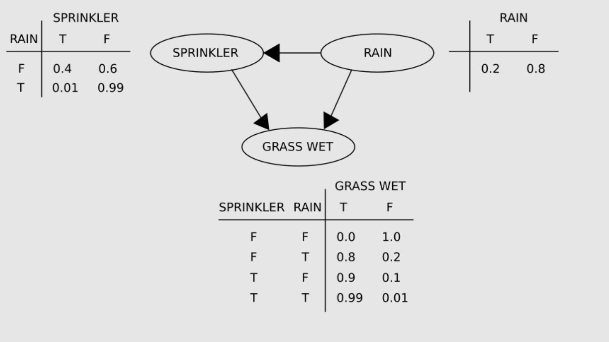

# Bayesian Belief Networks

## Problem Statement
Construct a causal network and follow the reasoning in the following story.

Mr. Holmes is working in his office when he receives a phone call from his neighbour informing him that his burglar alarm is ringing. Convinced that a burglar has broken into his house, Holmes rushes home in his car. On the way, he hears on the radio that there has been an earthquake in the area where his home is located. Earthquakes have a tendency to trigger burglar alarms. Now, Holmes must decide whether to continue going home or return to the office. Incorporate this scenario and explain his decisions.


# Sources
### Wikipedia
1. [Conditional probability](https://en.wikipedia.org/wiki/Conditional_probability)
2. [Bayes' theorem](https://en.wikipedia.org/wiki/Bayes%27_theorem)
3. [Bayesian network](https://en.wikipedia.org/wiki/Bayesian_network)
# Background
## Bayes' theorem
- **Bayes' theorem** gives a mathematical rule for inverting conditional probabilities, allowing us to find the probability of a cause given its effect.
### Statement of theorem
- Bayes' theorem is stated mathematically as the following equation:
```math
P(A|B) = \frac {P(B|A)P(A)}{P(B)}
```
where $`A`$ and $`B`$ are events and $`P(B) \neq 0`$.
- $P(A \mid B)$ is a conditional probability: the probability of event A occurring given that B is true. It is also called the posterior probability of $`A`$ given $`B`$.
- $P(B \mid A)$ is also a conditional probability: the probability of event B occurring given that A is true. It can also be interpreted as the likelihood of A given a fixed B because $`P(B|A) = L(A|B)`$.
- $`P(A)`$ and $`P(B)`$ are the probabilities of observing A and B respectively without any given conditions; they are known as the prior probability and marginal probability.

# Bayesian network
- A **Bayesian network** (also known as a **belief network**) is a probabilistic graphical model that represents a set of variables and their conditional dependencies via a directed acyclic graph.
- Bayesian networks are ideal for taking an event that occurred and predicting the likelihood that any one of several possible known causes was the contributing factor.
## A Belief Network on predicting the wetness of grass
- Consider the following Bayesian network: A model with the dependencies between three variables: the sprinkler (or its state - whether it is on or not), the presence or absence of rain and whether the grass is wet or not. Two events can cause the grass to become wet: an active sprinkler or rain. Rain has a direct effect on the use of the sprinkler (when it rains, the sprinkler is not active). This situation is modelled with a Bayesian network. 

- Each variable has two possible values, true and false.
The joint probability function (by the chain rule of probability) is given by,
```math
\Pr(G,S,R) = \Pr(G \mid S,R) \Pr(S \mid R) \Pr(R)
```
where G = "Grass wet (true/false)", S = "Sprinkler turned on (true/false)", and R = "Raining (true/false)".
- The model can answer questions about the presence of a cause given the presence of an effect like "What is the probability that it is raining, given the grass is wet?" by using conditional probability and summing over all the nuisance variables:
```math
\displaystyle 
\Pr(R = T \mid G = T)= {\frac {\Pr(G=T,R=T)}{\Pr(G=T)}} = {\frac {\sum _{x\in \{T,F\}}\Pr(G=T,S=x,R=T)}{\sum _{x,y\in \{T,F\}}\Pr(G=T,S=x,R=y)}}
```
- Using the expansion for the joint probability function $\Pr(G,S,R)$ and the conditional probabilities from the conditional probability tables, we can evaluate each term in the sums in the numerator and denominator. For example, 

```math
\Pr(G,S,R) = \text{Probablility that the grass is wet and the sprinkler is on and it is raining}
```
```math
\displaystyle 
\begin{aligned}
\Pr(G = T,S = T,R = T)
&= \Pr(G = T \mid S = T, R = T) \Pr(S = T \mid R = T) \Pr(R = T)\\
&= 0.99 \times 0.01 \times 0.2\\
&= 0.00198\\
&= 0.198\%.
\end{aligned}
```
- Then the numerical results (subscripted by the associated variable values) are
```math
\displaystyle 
\Pr(R = T \mid G = T) = {\frac {0.00198_{TTT} + 0.1584_{TFT}}{0.00198_{TTT} + 0.288_{TTF} + 0.1584_{TFT} + 0.0_{TFF}}}
= {\frac {891}{2491}}
\approx 35.77\%.
```