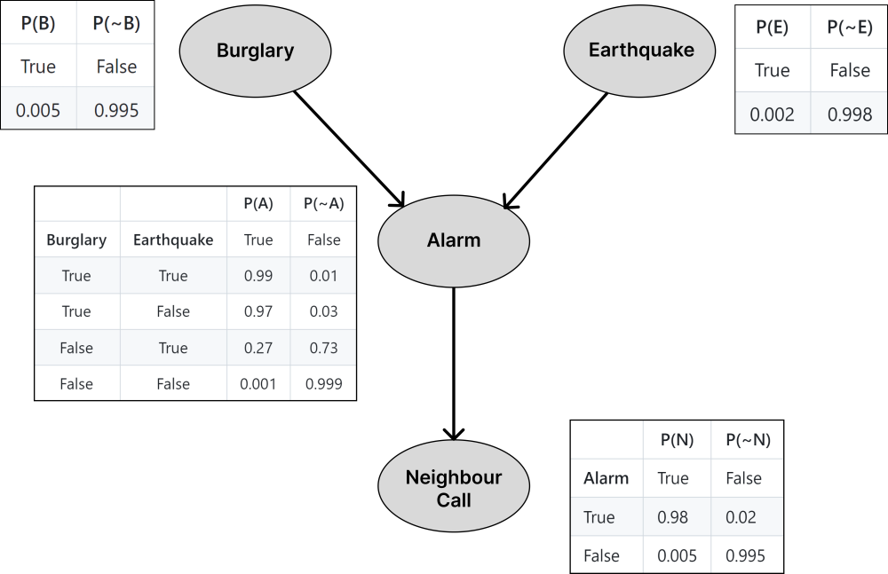

# Bayesian Belief Networks

## Problem Statement
Construct a causal network and follow the reasoning in the following story.

Mr. Holmes is working in his office when he receives a phone call from his neighbour informing him that his burglar alarm is ringing. Convinced that a burglar has broken into his house, Holmes rushes home in his car. On the way, he hears on the radio that there has been an earthquake in the area where his home is located. Earthquakes have a tendency to trigger burglar alarms. Now, Holmes must decide whether to continue going home or return to the office. Incorporate this scenario and explain his decisions.


# Sources
## Wikipedia
1. [Conditional probability](https://en.wikipedia.org/wiki/Conditional_probability)
2. [Bayes' theorem](https://en.wikipedia.org/wiki/Bayes%27_theorem)
3. [Bayesian network](https://en.wikipedia.org/wiki/Bayesian_network)
## Dependencies
1. [pgmpy (Python Library for Probabilistic Graphical Models)](https://pgmpy.org/)
   - pgmpy is a comprehensive library for working with probabilistic graphical models in Python. pgmpy is utilized extensively to construct, validate, and perform inference on a Bayesian Network.
2. [networkx](https://networkx.org/)
3. [matplotlib](https://matplotlib.org/stable/index.html)
   - Provides a visual representation of the network's structure, making it easier to understand the dependencies and relationships between variables.
   -  Generates bar charts to display the probabilities resulting from inference queries, aiding in decision-making and interpretation of results.
# Background
## Bayes' theorem
- **Bayes' theorem** gives a mathematical rule for inverting conditional probabilities, allowing us to find the probability of a cause given its effect.
- Bayes' theorem is stated mathematically as the following equation:
```math
P(A|B) = \frac {P(B|A)P(A)}{P(B)}
```
where $`A`$ and $`B`$ are events and $`P(B) \neq 0`$.
- $P(A \mid B)$ is a conditional probability: the probability of event $`A`$ occurring given that $`B`$ is true. It is also called the posterior probability of $`A`$ given $`B`$.
- $P(B \mid A)$ is also a conditional probability: the probability of event $`B`$ occurring given that $`A`$ is true. It can also be interpreted as the likelihood of $`A`$ given a fixed $`B`$ because $`P(B|A) = L(A|B)`$.
- $`P(A)`$ and $`P(B)`$ are the probabilities of observing $`A`$ and $`B`$ respectively without any given conditions; they are known as the prior probability and marginal probability.

# Bayesian network
- A **Bayesian network** (also known as a **belief network**) is a probabilistic graphical model that represents a set of variables and their conditional dependencies via a directed acyclic graph.
- Bayesian networks are ideal for taking an event that occurred and predicting the likelihood that any one of several possible known causes was the contributing factor.

# A Belief Network on predicting the probability of a burglary
- Burglary -> Alarm: A burglary directly influences the alarm. If a burglary occurs, the probability of the alarm ringing increases significantly.
- Earthquake -> Alarm: An earthquake can also cause the alarm to ring, even if there is no burglary. This creates an alternative explanation for the alarm being triggered.
- Alarm -> Neighbour Call: The neighbour's call is a direct result of the alarm ringing. If the alarm goes off (whether due to burglary or earthquake), the neighbour hears it and calls Mr. Holmes.


- If Holmes knows that the neighbour called him because of the alarm (i.e., Neighbour Call = True), he can query the network to find the probability of a burglary given that the earthquake occurred:
```math
P(Burglary \mid Neighbour Call = True,Earthquake = True )
```
- If the probability of a burglary is still high despite the earthquake, Holmes might decide to continue home, believing there is a real burglar.
- If the probability of a burglary is low and the earthquake is more likely to have triggered the alarm, Holmes may decide to return to his office.

# Running the project
You can run the project by executing the app.py file.
```bash
python app.py
```